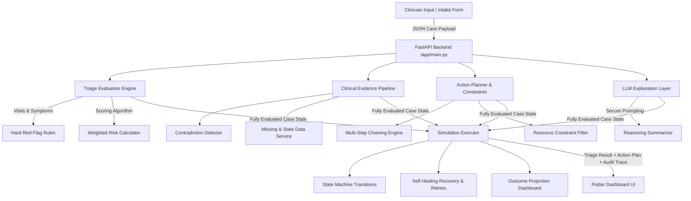

# TriageFlow AI — Patient Triage Agent
### Hospital-Grade Agentic Clinical Decision Support Prototype
> **⚠️ Clinical Safety Disclaimer:** This is an academic and hackathon prototype designed as a supervised decision-support tool. It does not diagnose disease, prescribe treatment, or replace the professional judgment of a licensed healthcare provider. **Not for clinical deployment.**

---

## 🏥 Project Overview
**TriageFlow AI** is a state-of-the-art, mobile-first, agentic decision-support prototype built to optimize emergency department triage operations. It translates multi-source patient inputs (demographics, vital signs, primary symptoms, written nurse notes, and historical data) into:
1. **Clinical Triage Classification** (Red, Orange, Yellow, Green, Blue urgency priority).
2. **Missing & Contradictory Data Resolution** (Safety-first discrepancy detection).
3. **Multi-Step Action Chaining** (Dynamic operational sequences aligned to triage categories).
4. **Constraint-Aware Alternatives** (Resource and waiting-room pressure adjustments).
5. **Self-Healing Simulation** (Autonomous failure recovery, retries, and local offline fallbacks).
6. **Measurable Outcomes** (Before-and-after projections of wait times and emergency queue positioning).

By combining a **deterministic, safety-locked scoring core** with a **flexible LLM-based explanation layer**, TriageFlow AI provides emergency clinicians with transparent, explainable, and fully auditable triage logic.

---

## 🏗️ System Architecture & Data Flow

TriageFlow AI uses a hybrid, multi-tier architecture consisting of a **FastAPI backend** (clinical decision-engine) and a **Flutter web client** (hospital operations dashboard), orchestrated by Google Antigravity.



### 1. Ingestion & Hard-Flag Rule Engine
Patient data is ingested as a structured `PatientCase`. Urgency is determined using a **hybrid logic gate**:
* **Deterministic Gate (Hard Safety Rules):** A battery of critical vital thresholds (e.g., $SpO_2 < 90\%$, Systolic BP $< 90\text{ mmHg}$, or severe central chest pain) bypasses average scores to immediately lock the patient into a **RED** or **ORANGE** priority. This prevents critical cases from being averaged down.
* **Weighted Score:** If no hard rules are triggered, the engine calculates a granular risk index ranging from `0.0` to `1.0` based on:
  $$\text{Risk Score} = 0.35 \times V_{\text{risk}} + 0.25 \times S_{\text{risk}} + 0.15 \times P_{\text{vulnerable}} + 0.10 \times D_{\text{pain}} + 0.10 \times W_{\text{wait}} + 0.05 \times R_{\text{pressure}}$$

### 2. Clinical Evidence Pipeline (`contradiction_service.py`)
To prevent clinician error, the agent passes the case through a safety pipeline:
* **Contradiction Detection:** Scans for operational mismatches (e.g., a high pain score of `9/10` reported alongside completely normal, relaxed vitals, or a documented primary complaint of "difficulty breathing" paired with normal respiratory rates).
* **Missing & Stale Data Auditing:** Calculates vital signal freshness using timestamp comparison. If critical telemetry is absent, it applies a confidence penalty, dropping the overall evaluation confidence score.

---

## 🤖 The Agentic AI Loop (Content-to-Action)

The core strength of TriageFlow AI is its **Autonomous Content-to-Action Agentic Loop** which runs whenever a patient case is triaged:

```
[Observe] Ingest Case, Vitals, and History
   ↓
[Orient] Detect Contradictions & Audit Freshness
   ↓
[Decide] Lock Urgency Level & Risk Index Deterministically
   ↓
[Plan]   Generate 3-5 Step Action Chain & Resolve Bed/Staff Constraints
   ↓
[Act]    Simulate Execution & Trace State Changes Step-by-Step
   ↓
[Recover] Auto-Retry Failed Pagers & Trigger Local Queue Fallbacks
   ↓
[Verify] Compare Before/After Outcome Metrics & Write Audit Logs
```

### 1. The Planning Phase (`planner_service.py`)
Translates analytical data into a sequence of operational instructions.
* For **RED/Critical** cases, it plans an emergency sequence: *Alert Emergency Doctor* ➡️ *Allocate Resus Bed* ➡️ *Setup Oxygen*.
* If vital telemetry is missing, it injects manual clinical validation tasks (*Request Missing Vitals/Clarification*) and schedules priority reviews.

### 2. Operational Constraint Filtering (`constraint_service.py`)
Validates the feasibility of the plan against current hospital resource matrices (`resources.json`, `queue.csv`). 
* If a resus bed is constrained (0 available beds), the checker automatically modifies the task chain, generating a designated fallback action (e.g. *Escalate to Ward Charge Nurse*) to clear the operational block.

### 3. Step-by-Step Execution Simulator (`executor_service.py`)
Simulates acting upon the physical world. Each action transitions through state changes:
$$\text{STARTED} \longrightarrow \text{RUNNING} \longrightarrow \text{SUCCEEDED} \ /\  \text{FAILED} \longrightarrow \text{RECOVERED}$$

### 4. Self-Healing Recovery (`recovery_service.py`)
The system intentionally forces a doctor pager network connection failure during the simulation. 
* The system attempts to retry the notification.
* If retries fail, the recovery service automatically triggers the task's pre-computed fallback action—generating an urgent, pre-formatted local SMS draft for secondary nursing staff—marking the task as `RECOVERED` without failing the workflow.

---

## 🧠 The LLM Explanation & Summarization Layer (`explanation_service.py`)
To keep reasoning highly transparent, TriageFlow AI includes an **Explanation-Only LLM Layer** designed with strict safety boundaries:

```
┌────────────────────────────────────────────────────────┐
│               DETERMINISTIC CLINICAL CORE              │
│  (Calculates Urgency, Risk Index, Vitals, Actions)     │
└───────────────────────────┬────────────────────────────┘
                            │ (Outputs deterministic structure only)
                            ▼
┌────────────────────────────────────────────────────────┐
│               LLM EXPLANATION LAYER                    │
│      (Generates reasoning summary & phrasing)          │
└───────────────────────────┬────────────────────────────┘
                            │ (Does NOT make safety-critical decisions)
                            ▼
┌────────────────────────────────────────────────────────┐
│              CLINICAL DASHBOARD / AUDIT                │
└────────────────────────────────────────────────────────┘
```

* **No LLM Triage Decision-Making:** To ensure clinical safety, LLMs are never used in the primary path to calculate priority levels, identify red flags, or determine urgency.
* **Explanation Phrasing:** The LLM receives the **fully processed output** of the deterministic backend and is instructed to summarize the clinical reasoning, synthesize the nurse's shorthand notes, and format a human-readable case overview.
* **Total Fallback Protection:** If the LLM provider fails, times out, or returns invalid outputs, the API automatically bypasses it and returns the deterministic reasoning array calculated by the core engine, guaranteeing that the application is always reliable and functional.

---

## 👥 Two-Member Technical Contribution (Equal Ownership)

The project was executed in perfect alignment with **SRS v2.0**, dividing equal workloads in lines of code, algorithmic complexity, and user-facing value:

### 👨‍💻 Member 01: Hasan (@hasana157) — Backend & Agent Architect
Hasan designed the core data engines, API interfaces, and deterministic clinical pathways:
* **FastAPI Backend Architecture:** Created the FastAPI web server, CORS configurations, standard exception handlers, and routing interfaces in `main.py`.
* **Deterministic Triage Engine (`triage_engine.py`):** Coded the clinical rule evaluators, hard red-flag checks (RF-001 through RF-007), and mathematical weighted scoring systems.
* **Action Planner & Constraint Service (`planner_service.py` & `constraint_service.py`):** Wrote the directed workflow planning engine, resource availability validators, and fallback action generators.
* **LLM Explanation Service (`explanation_service.py`):** Integrated the explanation-only generative AI reasoning engine, structured clinical prompts, and LLM connection timeout fallbacks.
* **Backend QA and Golden Suite:** Authored the complete `pytest` test suite containing 14 rigorous, green-verified integration test cases covering golden cases (CASE-001 to CASE-005).
* **Antigravity Artifact Integration:** Documented the API specifications, cost/latency sheets, and architectural plans.

### 👨‍💻 Member 02: Shahwar (@sahhwar) — Frontend & Recovery Engineer
Shahwar designed the Flutter UI client, contradiction trackers, and self-healing executors:
* **Hospital-Grade Flutter Web Application:** Created the entire responsive, color-coded clinical dashboard dashboard, custom badge widgets (`PriorityBadge`, `VitalsInputCard`, `SymptomChipSelector`), and transitions.
* **Clinical Evidence Pipeline (`contradiction_service.py`):** Authored the logical contradiction analyzer, mismatch validators, and stale vital timestamp freshness filters.
* **Execution Simulation Engine (`executor_service.py`):** Built the step-by-step simulator, tracking real-world state transitions and outputting clean JSON logs.
* **Self-Healing Recovery Engine (`recovery_service.py`):** Programmed the recovery handlers, self-correcting retry behaviors, and offline local communication failovers.
* **Frontend Manual QA & Layout Polish:** Debugged layout structures, resolved critical viewport vertical height overflows, and unified styling to use standardized Google Fonts.

---

## 🛠️ Installation & Execution Commands

### 1. Backend Server Setup
From the `backend/` directory:
```powershell
# Create and activate Python virtual environment
python -m venv .venv
.\.venv\Scripts\Activate.ps1

# Install requirements and boot local server
pip install -r requirements.txt
uvicorn app.main:app --host 127.0.0.1 --port 8000 --reload
```

### 2. Mobile Frontend Setup
From the `mobile/` directory:
```powershell
# Get dependencies and run Flutter Web
flutter pub get
flutter run -d web-server --web-port 8080 --web-hostname 127.0.0.1
```
Open **`http://127.0.0.1:8080/`** to interact with the clinical portal.
