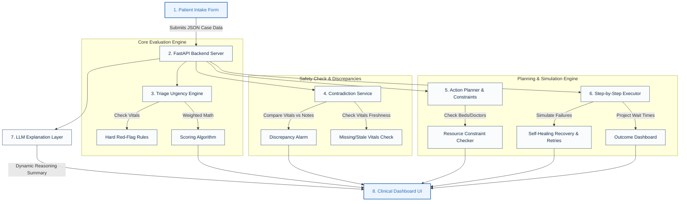

# TriageFlow AI — Patient Triage Agent

**TriageFlow AI** is a mobile-first decision-support prototype built to help emergency department staff triage patients quickly and consistently. It takes patient information (demographics, vital signs, symptoms, nurse notes, and history) and automatically:
1. Calculates a clinical urgency priority (Red, Orange, Yellow, Green, or Blue).
2. Detects clinical contradictions and missing vital data.
3. Generates a multi-step care plan to help guide patient care.
4. Checks resources (like beds and doctors) to adjust the plan when things are busy.
5. Simulates how these actions are executed, showing how to recover if a system or notification fails.

> **🏥 Medical Safety Note:** This tool is for decision support only. It does not diagnose, treat, or replace the judgment of a licensed doctor or nurse.

---

## 🛠️ How It Works (The Core Agent Flow)

The system operates in a simple, step-by-step loop every time a patient case is evaluated:

1. **Ingest & Validate:** The user enters the patient's data in the mobile app.
2. **Safety Screen:** The backend analyzes the vital signs. If any critical vital threshold is crossed (like extremely low oxygen), it instantly assigns a high priority (Red/Orange) to protect the patient.
3. **Resolve Discrepancies:** The pipeline checks for contradictory inputs (for example, if a patient reports "severe chest pain" but has perfect, relaxed vitals).
4. **Action Planning:** A multi-step care plan is created (such as: Alert Doctor ➡️ Allocate Bed ➡️ Prepare Oxygen).
5. **Constraint Check:** The plan checks if resources are actually available. If a bed or doctor is unavailable, the plan automatically switches to a fallback action.
6. **Execution Simulation:** The system simulates performing the actions, handles simulated network failures, retries, and records the final outcome.

---

## 🏗️ System Architecture

TriageFlow AI consists of two main parts: a **Flutter Mobile App** (Frontend) and a **FastAPI Server** (Backend). Here is a clean and simple view of how data flows between them:



---

## 🧠 The LLM Explanation Layer

To make clinical reasoning easy to understand, TriageFlow AI includes an **Explanation-Only LLM Layer**:

* **Safety Boundary:** The LLM is never used to decide the patient's triage priority, calculate scores, or choose safety-critical actions. All clinical logic is entirely handled by deterministic Python code.
* **Friendly Phrasing:** The LLM receives the final calculated results (such as priority level and vital details) and rewrites them into a friendly, plain-English summary of the clinical reasoning, explaining the vitals and simplifying the nurse's shorthand notes.
* **Reliability Fallback:** If the LLM service times out or is offline, the backend automatically bypasses the LLM and returns the core clinical reasoning calculated by the system, ensuring the application never crashes.

### 🔑 How to Enable Live LLM Integration (API Key Setup)
By default, the application runs locally using smart pre-compiled explanation templates to ensure zero latency and offline capability. If you wish to connect a live LLM model:
1. Create a `.env` file in the root directory of the project (or in the `backend/` directory) if it doesn't already exist.
2. Add your LLM provider API key to the environment variables:
   ```env
   # Add your Gemini API Key
   GEMINI_API_KEY=your_actual_api_key_here

   # Or add your OpenAI API Key (depending on configuration)
   OPENAI_API_KEY=your_actual_api_key_here
   ```
3. Restart the FastAPI backend server. The system will automatically detect the key and switch from local templating to live LLM generation, with automatic fallback protection active in case of API failure or network timeout.

---

## 👥 Project Team & Division of Work

The project was built by a two-member team with equal contributions, dividing the core agentic decision-and-action loops right down the middle:

### 🧠 The Agentic AI Workload Split (50/50)

| Phase of Agentic Loop | Component | Technical Owner | Why it is "Agentic AI" |
| :--- | :--- | :--- | :--- |
| **Think & Plan** | **Triage Urgency Engine** | 👩‍💻 **Hasana Zahid** | Translates raw vital telemetry and text note signals into clinical priority scores using hard rules and scoring logic. |
| **Think & Plan** | **Action Planner** | 👩‍💻 **Hasana Zahid** | Automatically designs a dynamic 3–5 step sequence of emergency operations tailored to the patient's condition. |
| **Think & Plan** | **Resource Constraints** | 👩‍💻 **Hasana Zahid** | Analyzes external environment data (bed/doctor matrices) and dynamically rewires plans to use fallbacks when resources are blocked. |
| **Think & Plan** | **LLM Explanation Layer** | 👩‍💻 **Hasana Zahid** | Secures prompt formatting and summarizes written clinician intake notes to make the agent's logic transparent. |
| **Act & Recover** | **Evidence Pipeline** | 👩‍💻 **Dur-e-Shahwar** | Scans for clinical anomalies (contradictions between vitals vs notes) and audits vital signal staleness to penalize agent confidence. |
| **Act & Recover** | **Simulation State Machine**| 👩‍💻 **Dur-e-Shahwar** | Directs the step-by-step physical execution of the action plan, managing state changes (`STARTED` ➡️ `RUNNING` ➡️ `SUCCEEDED` / `FAILED`). |
| **Act & Recover** | **Self-Healing Recovery** | 👩‍💻 **Dur-e-Shahwar** | Captures execution failures (like pager network timeouts), manages retry loops, and activates secondary backup protocols (like generating emergency local SMS drafts). |
| **Act & Recover** | **Outcome Analytics** | 👩‍💻 **Dur-e-Shahwar** | Calculates wait time changes and queue status changes to measure and prove the agent's operational success. |

---

### 👨‍💻 Hasana Zahid — Backend & Clinical Systems
Hasana developed the backend API server, clinical decision engine, and the planning algorithms:
* **FastAPI Server:** Created the entire web server setup, standard error handlers, and API routing.
* **Triage Urgency Engine (`triage_engine.py`):** Programmed the red-flag clinical safety checks and the weighted scoring mathematics.
* **Action Chain Planner (`planner_service.py` & `constraint_service.py`):** Wrote the algorithm that creates steps for patient care and checks resource availability (beds and doctors) to swap in fallback tasks.
* **LLM Explanation Service (`explanation_service.py`):** Integrated the generative reasoning summary prompts and built the connection-failure safeguards.
* **Backend QA Testing:** Built the backend testing suite with 14 automated integration tests to ensure that all priority paths evaluate correctly.

### 👨‍💻 Dur-e-Shahwar — Frontend UI & Recovery Systems
Dur-e-Shahwar built the Flutter application, visual dashboard interfaces, and the failure-recovery engine:
* **Flutter Mobile Application:** Designed the entire clinical portal layout, screen transitions, and custom widgets (like priority badges, vitals cards, and symptoms selectors).
* **Evidence Pipeline (`contradiction_service.py`):** Built the service that catches input errors, vital signal conflicts, and stale vital warnings.
* **Action Simulator (`executor_service.py`):** Programmed the step-by-step action simulation tracker that updates task states in real-time.
* **Self-Healing Recovery (`recovery_service.py`):** Built the logic that automatically retries failed tasks, and redirects to offline local fallbacks (like draft emergency SMS text generation) if a network alert fails.
* **Frontend QA & Polish:** Tested the app layout, resolved minor viewport layout height overflows to prevent rendering warnings, and polished styling and typography using Google Fonts.

---

## 🛠️ How to Run

### 1. Backend Server Setup
From the `backend/` directory:
```powershell
# Create and activate Python virtual environment
python -m venv .venv
.\.venv\Scripts\Activate.ps1

# Install requirements and boot server
pip install -r requirements.txt
uvicorn app.main:app --host 127.0.0.1 --port 8000 --reload
```

### 2. Mobile App Setup
From the `mobile/` directory:
```powershell
# Fetch packages and run Flutter Web
flutter pub get
flutter run -d web-server --web-port 8080 --web-hostname 127.0.0.1
```
Open **`http://127.0.0.1:8080/`** in your browser to view the application.
